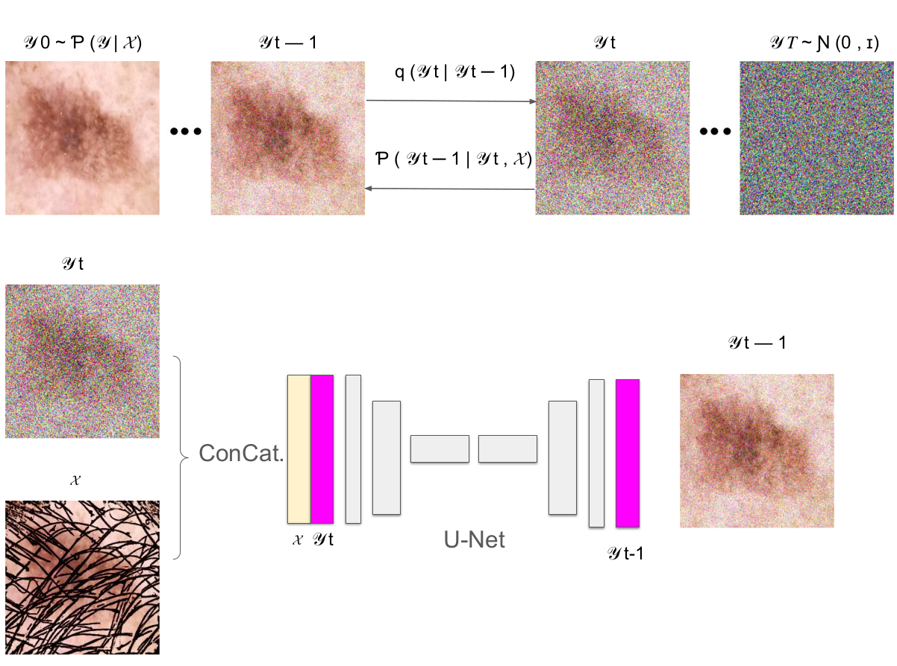

# DM-AHR
DM-AHR: a customized Self-Supervised Diffusion Model for Automatic Hair Removal in Dermoscopic Images for Enhanced skin diagnosis
This repository is the official PyTorch implementation of DM-AHR: a customized Self-Supervised Diffusion Model for Automatic Hair Removal in Dermoscopic Images for Enhanced skin diagnosis.

# Abstract

---
> This paper introduces DM-AHR, a novel self-supervised diffusion model for automatic hair removal in dermoscopic images to improve skin diagnosis accuracy, presenting a new dataset and demonstrating enhanced lesion analysis. It details DM-AHR's architecture, robust performance in preserving skin details.
><p align="center">
  
</p>

# How to Test
## Prerequisites:
Ensure Python is installed on your system.
Have the required libraries and dependencies installed as per the project requirements.

## Step 1: Access the Dataset
Our dataset, titled "DERMAHAIR," is specifically tailored for skin cancer classification post hair removal. It is accessible through the following Kaggle link: [DERMAHAIR](https://www.kaggle.com/datasets/riotulab/skin-cancer-hair-removal). Please download the dataset or opt to use the specific class for akiec located under dataset/akiec_16_128.zip. 

## Step 2: Extract the Dataset
Extract the contents of akiec_16_128.zip. Ensure all files are successfully extracted and available for further processing.

## Step 3: Configure Paths
Navigate to the config directory and open akiec.json. Here, update all paths to correspond to the locations where you extracted the dataset files. Confirm that all paths are accurate and accessible.

Step 4: Execute the Script
Once the dataset is extracted and paths are configured, you are ready to execute the testing script. Use the following command to initiate the process:

```bash
python main/sr.py -p val -c main/config/akiec.json
```
This script is set to run in validation mode for the AKIEC class, using the configurations provided in akiec.json.
# Downloading Model Weights
To ensure the accuracy and efficiency of your tests, it is crucial to use the appropriate model [weights](https://drive.google.com/drive/folders/1OINKjCZQNzU1OxFQ64i3GlYkgbe_zrIh?usp=sharing).

## License

This project is licensed under the Creative Commons Attribution-NonCommercial 4.0 International License. You are free to use, share, and adapt this material for non-commercial purposes, as long as you provide attribution to the original author(s) and the source.
## Acknowledgement

The codes are based on [SR3](https://github.com/Janspiry/Image-Super-Resolution-via-Iterative-Refinement).

## Contribute
For any questions or suggestions, please open an issue on the [GitHub issue tracker](https://github.com/AnasHXH/DM-AHR/issues).
